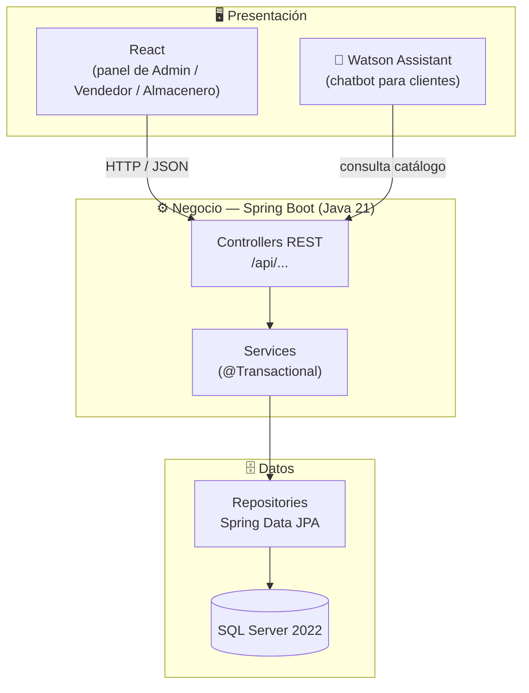
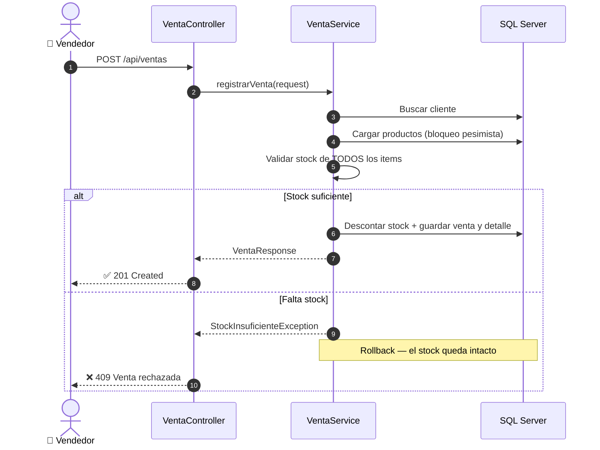

<div align="center">

# 🔩 FerreStock

### Sistema de Gestión de Inventario y Ventas para Ferretería

*Proyecto EFSRT — Cibertec*

<br/>

<a href="https://skillicons.dev">
  
</a>

<br/><br/>


</div>

---

## 📑 Contenido

- [¿Qué resuelve?](#-qué-resuelve)
- [Funcionalidades](#-funcionalidades)
- [Roles](#-roles)
- [Arquitectura](#-arquitectura)
- [Estructura del repositorio](#-estructura-del-repositorio)
- [Cómo levantar el proyecto](#-cómo-levantar-el-proyecto)
- [API — Módulo de Ventas](#-api--módulo-de-ventas)
- [Roadmap](#-roadmap)

---

## 🎯 ¿Qué resuelve?

Las ferreterías y distribuidoras pequeñas suelen llevar su stock y ventas en
**cuadernos o Excel**, lo que genera:

| ❌ Problema | ✅ Solución con FerreStock |
|---|---|
| Quiebres de stock inesperados | Control de inventario en tiempo real y alertas de stock bajo |
| Ventas sin comprobante ordenado | Registro de ventas con detalle, totales y estado |
| Stock descuadrado tras una venta | Descuento de stock **transaccional**: o se registra todo, o nada |
| Poca visibilidad del negocio | Reportes de ventas e inventario |
| Clientes que llaman para preguntar precios | Chatbot que responde disponibilidad y precios 24/7 |

---

## ✨ Funcionalidades

| Módulo | Descripción | Estado |
|---|---|:---:|
| 🛒 **Ventas** | Registro de ventas con validación y descuento transaccional de stock | ✅ |
| 📦 **Inventario** | Productos, categorías, entradas y salidas de almacén | 🚧 |
| 👥 **Clientes** | Gestión de clientes y su historial de compras | 🚧 |
| 📊 **Reportes** | Ventas por periodo, productos más vendidos, stock bajo | 📝 |
| 🤖 **Chatbot** | Consulta de catálogo, disponibilidad y precios con Watson Assistant | 📝 |
| 🔐 **Seguridad** | Autenticación y permisos por rol | 📝 |

<sub>✅ Funcional · 🚧 En progreso · 📝 Planificado</sub>

---

## 👤 Roles

| Rol | Puede… |
|---|---|
| 🛡️ **Administrador** | Gestionar usuarios, productos y precios; ver todos los reportes |
| 💼 **Vendedor** | Registrar ventas y consultar stock y clientes |
| 📦 **Almacenero** | Registrar entradas y salidas de mercadería, ajustar stock |
| 🙋 **Cliente** | Consultar el catálogo y usar el chatbot |

---

## 🏗️ Arquitectura

**Monolito en capas** (Presentación / Negocio / Datos), con módulos organizados
por carpeta dentro de este repositorio.



### 🔄 Flujo de una venta

El registro de venta es **una sola transacción**: si algún producto no tiene
stock suficiente, la venta se rechaza y **no se modifica nada**.



### 🧰 Stack tecnológico

| Capa | Tecnología |
|---|---|
| **Backend** | Java 21 · Spring Boot 4 · Spring Data JPA · Bean Validation · Lombok |
| **Base de datos** | Microsoft SQL Server 2022 |
| **Frontend** | React |
| **Chatbot** | IBM Watson Assistant |
| **Build** | Maven (wrapper incluido) |
| **Desarrollo local** | Docker |
| **Despliegue** | Microsoft Azure |

---

## 📁 Estructura del repositorio

```text
ferrestock/
├── README.md
└── ventas-service/                      # Módulo de Ventas (Spring Boot)
    ├── .env.example                     # Plantilla de credenciales (copiar como .env)
    ├── pom.xml
    ├── mvnw / mvnw.cmd                  # Maven wrapper
    └── src/
        ├── main/
        │   ├── java/pe/edu/cibertec/ferrestock/ventas/
        │   │   ├── config/              # DataSeeder (datos de ejemplo)
        │   │   ├── controller/          # Endpoints REST
        │   │   ├── dto/                 # Request / Response
        │   │   ├── entity/              # Producto, Cliente, Venta, DetalleVenta
        │   │   ├── exception/           # Errores 400 / 404 / 409
        │   │   ├── repository/          # Spring Data JPA
        │   │   └── service/             # Lógica de negocio transaccional
        │   └── resources/application.yaml
        └── test/                        # Tests unitarios
```

---

## 🚀 Cómo levantar el proyecto

### Requisitos

- ☕ **JDK 21**
- 🐳 **Docker Desktop** (para SQL Server)
- 🔧 Git

### 1. Clonar el repositorio

```bash
git clone https://github.com/MichaelLunaDev/ferrestock.git
cd ferrestock/ventas-service
```

### 2. Levantar SQL Server 2022 en Docker

Elige una contraseña segura (mayúsculas, minúsculas, números y un símbolo):

```powershell
docker run -d --name ferrestock-mssql --restart unless-stopped `
  -e ACCEPT_EULA=Y -e MSSQL_SA_PASSWORD="<tu_password>" `
  -p 14333:1433 -v ferrestock-mssql-data:/var/opt/mssql `
  mcr.microsoft.com/mssql/server:2022-latest
```

Crear la base de datos (Hibernate crea las tablas, pero no la base):

```powershell
docker exec ferrestock-mssql /opt/mssql-tools18/bin/sqlcmd -S localhost -U sa -P "<tu_password>" -C -Q "CREATE DATABASE ferrestock_ventas"
```

> 💡 El contenedor se reinicia solo con Docker y los datos se guardan en el volumen `ferrestock-mssql-data`.

### 3. Configurar credenciales

```powershell
copy .env.example .env
```

Edita `.env` y completa `DB_PASSWORD`. La aplicación lo lee automáticamente.

> ⚠️ **Nunca subas el `.env` a GitHub.** Ya está en el `.gitignore`.

### 4. Ejecutar la aplicación

```powershell
.\mvnw.cmd spring-boot:run      # Windows
./mvnw spring-boot:run          # Linux / macOS
```

Si todo va bien, en el log verás:

```text
Started FerrestockVentasApplication in X seconds
Datos de ejemplo cargados: 10 productos y 3 clientes
```

La API queda en **http://localhost:8080** 🎉

### 5. Ejecutar los tests

```powershell
.\mvnw.cmd test -Dtest=VentaServiceTest
```

---

## 🛒 API — Módulo de Ventas

| Método | Endpoint | Descripción | Respuestas |
|:---:|---|---|---|
|  | `/api/productos` | Lista los productos con su stock | `200` |
|  | `/api/ventas` | Registra una venta | `201` · `400` · `404` · `409` |
|  | `/api/ventas` | Lista las ventas | `200` |
|  | `/api/ventas/{id}` | Venta con su detalle | `200` · `404` |

<details>
<summary><b>📨 Ejemplo: registrar una venta</b></summary>

```json
POST /api/ventas
{
  "clienteId": 1,
  "vendedor": "jlopez",
  "items": [
    { "productoId": 1, "cantidad": 1 },
    { "productoId": 5, "cantidad": 10 }
  ]
}
```

</details>

<details>
<summary><b>🚫 Ejemplo: venta rechazada por falta de stock (409)</b></summary>

```json
{
  "status": 409,
  "title": "Venta rechazada",
  "detail": "Stock insuficiente. La venta fue rechazada y no se modificó ningún producto.",
  "faltantes": [
    "Rodillo de felpa 9 pulg. con bandeja (id 10): solicitado 5, disponible 2"
  ]
}
```

</details>

<details>
<summary><b>💻 Probar desde PowerShell</b></summary>

```powershell
# Listar productos
curl.exe http://localhost:8080/api/productos

# Venta rechazada: pide 5 rodillos y solo hay 2 → 409
curl.exe -i -X POST http://localhost:8080/api/ventas -H "Content-Type: application/json" -d '{\"clienteId\":2,\"vendedor\":\"jlopez\",\"items\":[{\"productoId\":3,\"cantidad\":2},{\"productoId\":10,\"cantidad\":5}]}'
```

> En PowerShell usa `curl.exe`, no `curl` (que es un alias de `Invoke-WebRequest`).

</details>

### 🧪 Datos de ejemplo

Al iniciar con la base vacía se cargan **10 productos** y **3 clientes**.
Para probar el rechazo por stock, estos productos tienen poco stock a propósito:

| ID | Producto | Stock |
|:---:|---|:---:|
| 6 | Arena gruesa (saco 40 kg) | **3** |
| 10 | Rodillo de felpa 9 pulg. con bandeja | **2** |

---

## 🗺️ Roadmap

- [x] Módulo de ventas con descuento transaccional de stock
- [x] Conexión a SQL Server y datos de ejemplo
- [ ] Anulación de ventas con devolución de stock
- [ ] Módulo de inventario (entradas y salidas de almacén)
- [ ] Autenticación y permisos por rol (Spring Security)
- [ ] Frontend en React
- [ ] Chatbot con Watson Assistant
- [ ] Reportes de ventas e inventario
- [ ] Despliegue en Azure

---

<div align="center">

Hecho con ☕ y 🔩 para el **EFSRT — Cibertec**

</div>
